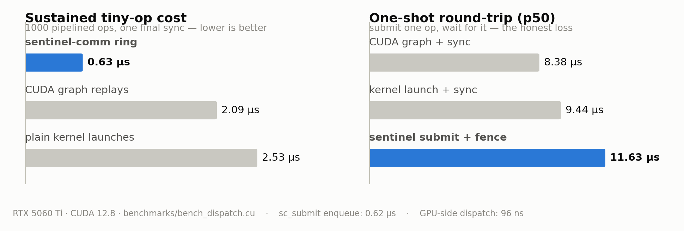

# sentinel-comm

**Stop launching kernels. Start sending commands.**

A persistent-kernel CPU→GPU command bus for C++ engine builders: one CUDA
kernel launches at boot and never exits; the host talks to it through a
lock-free ring buffer. Dispatching GPU work becomes a 64-byte write —
**0.5 µs to enqueue, ~96 ns GPU-side dispatch, no `cudaLaunchKernel`, no
driver round-trip**.

<picture>
  <source media="(prefers-color-scheme: dark)" srcset="docs/img/bench-dark.png">
  
</picture>

```
measured on RTX 5060 Ti (Blackwell), benchmarks/bench_dispatch.cu:

  burst of 1000 tiny ops (pipelined)     per-op
    plain kernel launches                1.3–2.6 µs
    CUDA graph replays                   2.1 µs
    sentinel-comm ring                   0.62 µs      ← 3–4× faster
  CPU cost to enqueue one op
    cudaLaunchKernel                     1.3–2.6 µs
    sc_submit()                          0.5 µs       (one 64-byte write)
  GPU-side reaction (decode→complete)    ~96 ns
```

Extracted from PROJECT DATGMAC's Sentinel architecture; stripped of everything
inference-specific. Two source files, one header, zero dependencies beyond the
CUDA runtime.

📖 **Read first if you run other CUDA libraries in-process:**
[Why your persistent kernel deadlocks llama.cpp](docs/why-your-persistent-kernel-deadlocks.md)
— the empirically-bisected failure mode nobody writes down.

## Who this is for

Any engine pushing **high-rate streams of small GPU operations** where launch
overhead dominates: game/physics engines micro-stepping simulations, real-time
audio/DSP graphs, robotics control loops, custom ML runtimes, GPU-resident
state machines. If your profiler shows `cuLaunchKernel` between every tiny
kernel, this is the cure.

## Why not CUDA Graphs?

CUDA Graphs are the right tool when the *same* DAG of kernels replays
unchanged: capture once, replay at ~2 µs. Use them if your workload is
static. Sentinel-comm targets what graphs can't express:

- **Dynamic command streams** — every packet carries fresh opcodes and
  arguments; nothing is captured or instantiated. A graph with different
  parameters needs `cudaGraphExecUpdate` or re-capture (and re-capture
  deadlocks against any resident persistent kernel — including this one).
- **Cheaper enqueue** — `sc_submit()` is a 64-byte write + memory fence
  (~0.5 µs, no driver call). Measured 3–4× more sustained tiny-op
  throughput than graph replay (0.62 vs 2.1 µs/op).
- **GPU-side reaction time** — a resident kernel picks work up in ~96 ns
  once hot; a graph replay still pays the launch path.
- **CPU-in-the-loop decisions** — submit is cheap enough to decide
  per-command at kHz–MHz rates.

Where graphs (or plain streams) beat this bus, honestly measured: **isolated
request→response round-trips** (submit one command, block on its fence, ~10–12
µs p50 vs ~8–9 µs for launch+sync) — the PCIe polling hop and idle backoff
dominate there. If your pattern is strictly ping-pong with the host idle in
between, a stream is fine and simpler.

**Loses the ping (11.6 µs). Wins the flood (0.63 µs/op).**

## Architecture

```
┌──────────────── Host (CPU) ────────────────┐
│  sc_submit(op, args…)                       │
│      └─ writes 64-byte packet ──┐           │
│  sc_wait_fence(id) ◄─ polls ─┐  │           │
└──────────────────────────────┼──┼───────────┘
        pinned, mapped host mem│  │ory (PCIe)
┌──────────────────────────────┼──┼───────────┐
│  fence_values[256] ──────────┘  ▼           │
│              ┌─────────────────────────┐    │
│              │  SENTINEL KERNEL        │    │
│              │  1 block × 256 threads  │    │
│              │  while (!shutdown) {    │    │
│              │    poll(ring)           │    │
│              │    dispatch(opcode) ────┼──► your sc_user_dispatch()
│              │    signal(fence)        │    │
│              │    idle→exp. backoff    │    │
│              │  }                      │    │
│              └─────────────────────────┘    │
└──────────────── GPU ────────────────────────┘
```

- **Ring buffer**: single-producer/single-consumer, 64-byte cache-line-aligned
  command packets, no locks. Host advances `write_head`, GPU advances `read_tail`.
- **Fences**: 256 monotonic counters in the shared header. GPU bumps one on
  command completion; host polls at 1 µs granularity.
- **Idle backoff**: the dispatcher sleeps 200 ns → 100 µs exponentially while
  idle, so a quiet bus doesn't flood PCIe or starve co-resident CUDA work; the
  first command snaps it back to hot polling.
- **Footprint**: one block of 256 threads — one SM. The rest of the GPU stays
  available for ordinary kernels.

## Quick start

```bash
mkdir build && cd build
cmake ..                # add -DCMAKE_CUDA_ARCHITECTURES=... for other GPUs
make -j$(nproc)
./test_roundtrip        # smoke test — should print ALL PASSED
./hello_roundtrip       # latency probe + vector add through the ring
./bench_dispatch        # vs cudaLaunchKernel and CUDA Graphs, on YOUR gpu
```

> If configure fails with `_Float32` errors, your default g++ is newer than
> your CUDA toolkit supports — point CMake at a supported one, e.g.
> `cmake .. -DCMAKE_CUDA_HOST_COMPILER=/usr/bin/g++-12`.

```cpp
#include "sentinel_comm.h"

sc_init(/*device=*/0, /*ring_capacity=*/0, /*pin_cpu_core=*/-1);
// allocate ALL your device memory here, before launch — see The One Rule
sc_launch(/*user_data=*/my_device_ctx);

sc_submit(MY_OPCODE, SC_FLAG_FENCE_SIGNAL, dev_ptr, size, 0, 0, /*fence=*/1);
sc_wait_fence(1, 1, /*timeout_ns=*/1000000000);

sc_shutdown();
```

## Adding your own GPU operations

`src/user_handlers.cu` is **your** file — the bus routes every opcode
`>= SC_OP_USER_BASE` to the single `sc_user_dispatch()` you define:

```cpp
__device__ int sc_user_dispatch(const ScCommand* cmd, void* user_data,
                                int tid, int num_threads) {
    switch (cmd->opcode) {
        case MY_PHYSICS_STEP: {
            World* w = (World*)cmd->arg0;         // args are yours
            for (int i = tid; i < w->n; i += num_threads)  // 256 workers
                integrate(w->bodies[i], cmd->arg1);
            return SC_OK;
        }
    }
    return -1;  // unknown → error counter
}
```

All 256 sentinel threads enter together (thread 0 is the dispatcher, the rest
are workers) — grid-stride with `tid`/`num_threads`. Requires CUDA separable
compilation (`-rdc=true`; the CMake project sets it up).

## API

| Function | Purpose |
|---|---|
| `sc_init(dev, capacity, pin_core)` | Allocate ring + control state. `pin_core=-1` leaves host scheduling alone. |
| `sc_launch(user_data)` | Start the persistent kernel; `user_data` reaches every handler. |
| `sc_submit(op, flags, a0..a3, fence)` | Enqueue one packet. Non-blocking; `SC_ERR_RING_FULL` if GPU lags. |
| `sc_wait_fence(id, expected, timeout_ns)` | Block until the GPU signals. |
| `sc_fence_value(id)` / `sc_pending()` / `sc_is_running()` | Introspection. |
| `sc_get_stats(&s)` | GPU-side counters: processed, errors, last dispatch ns, uptime. |
| `sc_shutdown()` | Graceful exit (SHUTDOWN opcode → join → free). |
| `sc_error()` | Last error string. |

## ⚠ The One Rule: no implicit device-wide syncs while resident

A persistent kernel **never completes**, and several innocuous-looking CUDA
calls wait for the device to go idle — they will **deadlock your process at
100% GPU** while the sentinel runs. Empirically confirmed offenders:

- `cudaFree` / `cudaFreeHost` (documented to synchronize)
- `cudaDeviceSynchronize` (obviously)
- CUDA **graph capture / instantiation** (e.g. libraries using cudaGraphs internally)
- first-touch lazy allocations inside libraries (cuBLAS workspace creation on a
  new shape, cuDNN plans, …)

Rules of thumb, learned the hard way in the parent project:

1. **Allocate everything before `sc_launch()`**, free everything after
   `sc_shutdown()`.
2. Don't run alloc-happy libraries (cuBLAS/cuDNN/llama.cpp/…) in the same CUDA
   context while the sentinel is resident, unless you have pre-warmed every
   shape they will ever see.
3. Co-tenancy that must be robust belongs in a **separate process** (separate
   CUDA context), or park the sentinel: `sc_shutdown()` before the risky phase,
   `sc_launch()` after — relaunch costs one ordinary kernel launch (~µs).

The bus itself is safe: it allocates only at `sc_init` and frees only at
`sc_shutdown`.

## Design notes

- **Pinned mapped memory, not `cudaMallocManaged`**: managed pages migrate
  back and forth while the GPU spin-polls and the CPU writes — the UVM fault
  storm holds driver locks and can starve every CUDA client in the process.
  Pinned memory has no faults: CPU access is plain memory, GPU polls via PCIe
  reads. This single choice is the difference between "works" and "mystery
  hangs".
- **Why 64-byte packets**: one L2 cache line per poll; a command is one PCIe
  read.
- **Batched dequeue**: dequeuing one command at a time costs several
  non-posted PCIe reads + atomics per command (~11 µs/op measured). The
  dispatcher instead claims up to 64 pending commands per poll, fetches them
  into shared memory with coalesced 16-byte reads, and updates
  tail/counters once per batch — 0.62 µs/op, an 18× improvement that the
  benchmark caught before release.
- **Fence signaling** uses `atomicAdd` + `__threadfence_system()` so host
  visibility is ordered after the data your handler wrote.
- **`pin_cpu_core`**: submission jitter drops if the submitting thread owns a
  core with SCHED_FIFO (needs `CAP_SYS_NICE`); off by default because a library
  shouldn't hijack your scheduler.

## Limitations (honest)

- One sentinel per process (global state, single ring). Multi-ring/multi-GPU
  is a straightforward extension — every function takes a context struct in
  spirit; it just isn't plumbed yet.
- SPSC: one submitting thread (or external serialization).
- Handlers run on 256 threads of one SM — this is a *command bus*, not a
  compute framework. For heavy math, have a handler launch work via dynamic
  parallelism, or use the bus to orchestrate buffers consumed by ordinary
  kernels between bus phases.
- Linux-focused (`sched.h` thread pinning; the rest is portable CUDA).

## Origin

Extracted 2026-07-06 from PROJECT DATGMAC (GPU-native inference runtime),
where this bus dispatches commands at 96–600 ns measured latency. The
deadlock rules above were bisected empirically against llama.cpp co-tenancy —
they are not theoretical.
